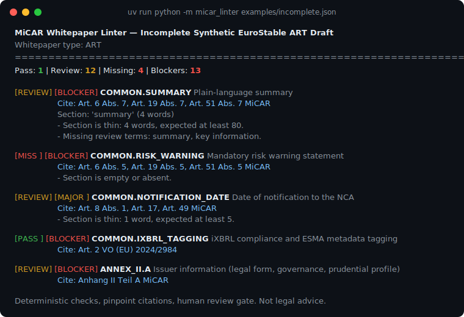

# MiCAR Whitepaper Linter

[](https://github.com/sebastianfoerste/micar-whitepaper-linter/actions/workflows/ci.yml)

The MiCAR Whitepaper Linter is a deterministic Python tool for reviewing draft crypto-asset white papers under MiCAR. It maps Annex requirements into code check classes and produces cited review artifacts over synthetic examples.

**[Try it live in your browser](https://sebastianfoerste.github.io/micar-whitepaper-linter/playground/)**. The full linter runs client-side via Pyodide. Nothing you paste leaves the page.



## Real-world study: MiCAR Title II white papers

This repository now includes a reproducible pilot study over publicly available Title II crypto-asset white papers listed in ESMA's MiCA register.

The study runs deterministic Annex I checks over a sample of notified white papers and reports recurring potential disclosure gaps with source hashes, methodology, limitations, and pending human-review examples.

Read the study:
`studies/2026-07-title-ii-annex-i-whitepaper-study/findings-summary.md`

Raw white papers are not committed. Study outputs are deterministic first-pass research artifacts and are not legal advice.

## Run it

```bash
make install
make test
make demo
```

Generate a review bundle from synthetic data:

```bash
uv run --extra dev python -m micar_linter examples/incomplete.json --review-bundle-dir /tmp/micar-incomplete-review-bundle
```

## Use as a GitHub Action

Lint a whitepaper draft on every push. The job fails while BLOCKER-severity findings are open:

```yaml
jobs:
  micar-lint:
    runs-on: ubuntu-latest
    steps:
      - uses: actions/checkout@v4
      - uses: sebastianfoerste/micar-whitepaper-linter@main
        with:
          whitepaper: drafts/whitepaper.json
          strict: 'true'
```

Inputs: `whitepaper` (path to a JSON/XHTML/DOCX draft), `strict` (default `true`), `extra-args` (e.g. `--json`, `--coverage`). A failing job means open blockers to review, not a legal conclusion.

## Reviewer Route

For a short proof review, follow this path:

1. Read `docs/launch-readiness.md`.
2. Read `docs/sample-review-bundle.md`.
3. Read `studies/2026-07-title-ii-annex-i-whitepaper-study/findings-summary.md`.
4. Inspect `src/micar_linter/rules/`.
5. Run `make check`.

This route keeps the human-review boundary visible while showing the deterministic rules, synthetic examples, and 2026 study methodology.

## Core features

- Deterministic regulatory audits for MiCAR Annex I, II and III.
- JSON, XHTML and DOCX parsing.
- Rules-as-code severity engine.
- JSON reports for automated checks.
- Local artifact manifests and remediation reports.
- Coverage matrices, review tables and batch packs.
- Review table export: adds rule-by-rule rows with blocker status, citations, remediation, reviewer decision state and bundle export eligibility.
- Workspace export: `--workspace-output <path>` writes a local batch vault, conditional review table and reusable review playbook. Open blockers keep filing and external-review readiness disabled.

## What this proves

MiCAR white-paper requirements can be encoded as deterministic, cited and testable rules. Annex selection is explicit, rule IDs are stable, missing disclosures produce cited findings, severity is tested, and JSON outputs can be used by review workflows without hiding the legal basis.

The tool preserves legal judgment. It identifies disclosure gaps and produces draft review artifacts. It does not decide whether a white paper is lawful or complete.

## Tech stack

Python, Hatchling, uv and pytest.

## Reviewer checklist

- Run `make check`.
- Run `uv run micar-lint examples/art-stablecoin.json`.
- Run `uv run micar-lint examples/incomplete.json`.
- Generate a review bundle from a synthetic example.
- Confirm fixture labels are synthetic.
- Confirm report output states that the tool is not legal advice.
