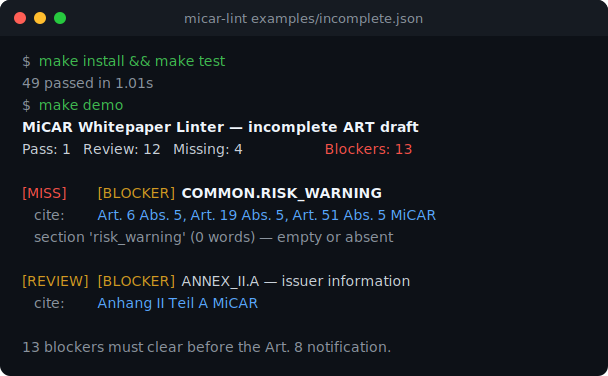

# MiCAR Whitepaper Linter

The MiCAR Whitepaper Linter is a deterministic Python tool and command-line application designed to validate draft crypto-asset white papers under the Markets in Crypto-Assets Regulation (MiCAR - Regulation (EU) 2023/1114). It maps Annex requirements (Annex I, II, III) directly into code check classes.

---

## What it does
The linter parses draft white papers represented in JSON, XHTML (Inline XBRL), or DOCX formats, identifies the regulatory token regime (Other Crypto-Asset, ART, EMT), runs rule checklists (risk warnings, reserve policies, redemption access, registry metrics), and prints structured markdown audits or outputs JSON payloads.

---

## Reviewer Demo Path

Clone, install, and watch it catch blockers in a synthetic ART draft:

```bash
make install   # uv sync --extra dev
make test      # 49 tests
make demo      # lint examples/incomplete.json — cited blockers, deterministic
```



Run the full local gate with `make check`, or generate the review bundle from synthetic data:

```bash
uv run --extra dev python -m micar_linter examples/incomplete.json \
  --review-bundle-dir /tmp/micar-incomplete-review-bundle
```

The outputs are review artifacts for a qualified lawyer. They do not certify a
white paper, approve a notification or replace legal review.

The example issuers, tokens, dates, register numbers and authority references in
`examples/` are fictional synthetic fixtures for local testing.

## Quick Start

Run one synthetic white paper and inspect cited findings:

```bash
uv run --extra dev python -m micar_linter examples/art-stablecoin.json --json
```

For human-readable output:

```bash
uv run --extra dev python -m micar_linter examples/incomplete.json
```

The output is a first-pass rule report with citations, severity, status and review notes. It is not legal advice and does not replace lawyer review.

---

## Core Features
- **Deterministic Regulatory Audits**: Maps statutory rules for Annex I (other crypto-assets), Annex II (Asset-Referenced Tokens), and Annex III (E-Money Tokens).
- **Multiple Document Format Parsers**: Extracts white paper blocks from XHTML (Inline XBRL tags), JSON structures, and DOCX files.
- **Rules-as-Code Engine**: Implements severity scales (Blocker, Major, Minor, Pass) for compliance findings.
- **CI/CD Integrations**: Outputs machine-readable JSON reports suitable for automated pipeline checks.
- **Artifact Manifests & Remediation Reports**: Writes local SHA-256 manifests and structured remediation plans for open findings. Manifests include export eligibility and missing-output warnings, but do not store raw confidential source snippets.
- **Coverage Matrices & Batch Packs**: Writes disclosure coverage matrices, source-anchor metadata, and directory-level batch review packs with hashes, blocker IDs, and manifest digests.

---

## What this proves

This repository shows that MiCAR white-paper requirements can be encoded as deterministic, cited and testable rules. It is a regulation-as-code proof: annex selection is explicit, rule IDs are stable, missing mandatory disclosures produce cited findings, severity is tested, and JSON outputs can be used by review workflows without hiding the legal basis.

The tool deliberately preserves legal judgment. It identifies disclosure gaps and produces draft review artifacts. It does not decide whether a white paper is lawful, complete for filing or commercially acceptable.

The report language treats blocker findings as package-readiness issues. Open
blockers mean the draft should stay out of an external review or filing workflow
until the gaps are cured and a lawyer has signed off.

---

## Tech Stack
- **Runtime**: Python (>= 3.13)
- **Packaging/Installer**: Hatchling, `uv`
- **Optional File Parsers**: `python-docx` (DOCX), `pypdf` (PDF)
- **Testing**: pytest

---

## Repository Structure
- `src/micar_linter/`: Source modules.
  - `rules/`: Concrete Annex I, II, III check files.
  - `ixbrl.py` & `xhtml_parser.py`: iXBRL XHTML tag compilers.
  - `document.py` & `whitepaper.py`: Logical document abstractions.
  - `report.py`: Compile final audit reports.
  - `cli.py` & `__main__.py`: CLI interface.
- `tests/`: Pytest files checking parser stability.
- `examples/`: Sample compliant and incomplete white papers.
- `reports/`: Text logs of sample run results.

---

## Setup & Running Instructions

### 1. Install Library
Sync dependencies using `uv`:
```bash
uv sync --all-extras
```
Or use pip inside a virtual environment:
```bash
pip install -e ".[all]"
```

### 2. Running the Linter
Run the linter against a document:
```bash
# Run CLI
uv run micar-lint examples/incomplete.json

# Write a complete reviewer bundle
uv run micar-lint examples/incomplete.json \
  --review-bundle-dir reports/incomplete-review-bundle

# Batch review a directory
uv run micar-lint examples \
  --batch-output reports/example-batch-pack.json
```

---

## Testing Commands
Run the full local proof gate:
```bash
make check
```

Run the pytest suite directly:
```bash
uv run --extra dev pytest
```

## Extending the rule set

See [How to Extend the Rule Set](docs/rule-extension-guide.md) before adding a new disclosure rule.

## Reviewer Checklist

Use this checklist when evaluating the repository as a portfolio project or employer demo:

- [ ] Run `make check` - 48 tests pass (ruff lint, pytest suite, smoke command).
- [ ] Run `uv run micar-lint examples/art-stablecoin.json` - report prints blocker summary and lawyer sign-off block.
- [ ] Run `uv run micar-lint examples/incomplete.json` - report correctly flags BLOCKER items and signals package-not-ready.
- [ ] Run `uv run micar-lint examples/incomplete.json --review-bundle-dir /tmp/micar-review-bundle` - one command writes checklist, remediation, coverage, sign-off and manifest files.
- [ ] Run `uv run micar-lint examples --batch-output /tmp/batch.json` - batch output written with per-file findings.
- [ ] Review `src/micar_linter/report.py` - confirm blocker language says "should not enter filing workflow" not "cannot proceed".
- [ ] Review `tests/test_cli.py::test_cli_report_language_keeps_blockers_review_gated` - regression guard on legal language.
- [ ] Review `examples/art-stablecoin.json` - confirm fixture labels are synthetic (fictional issuer, dates, registration).
- [ ] Review `PRIVACY.md` - confirm demo boundary and synthetic-only requirement.
- [ ] Review [docs/sample-review-bundle.md](docs/sample-review-bundle.md) - confirms synthetic review bundle outputs.
- [ ] Confirm "This tool is not legal advice." appears in every report output.
