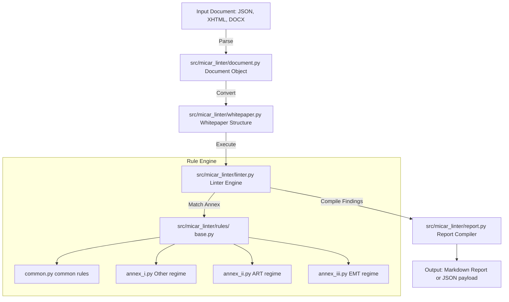

# System Architecture: MiCAR Whitepaper Linter

This document explains the internal modules, parsing pipeline, and rules-as-code structure of the MiCAR Whitepaper Linter.

## System Pipeline

The linter acts as a deterministic parser and check engine:

---

## Technical Components

### 1. Document Parsing Layer
Normalizes inputs into structural sections:
- **`document.py`**: Base document model tracking raw text, headings, and tables.
- **`xhtml_parser.py`** & **`ixbrl.py`**: Parse Inline XBRL XHTML files, extracting tagged compliance attributes.

### 2. Regulatory Regimes (`rules/`)
All validation rules inherit from `rules.base.BaseRule`:
- **`common.py`**: Validates basic information required for all whitepapers (e.g. issuer identity details, default warning clauses).
- **`annex_i.py`**: Specific to Other Crypto-Assets.
- **`annex_ii.py`**: Specific to Asset-Referenced Tokens (verify reserve assets disclosures, redemption rights).
- **`annex_iii.py`**: Specific to E-Money Tokens (verify issuer licensing, redeemability details).

### 3. Report Compiler (`report.py`)
Collects and groups rule findings, prioritizing blocker flags (conditions that would cause regulatory rejection) over recommendations.