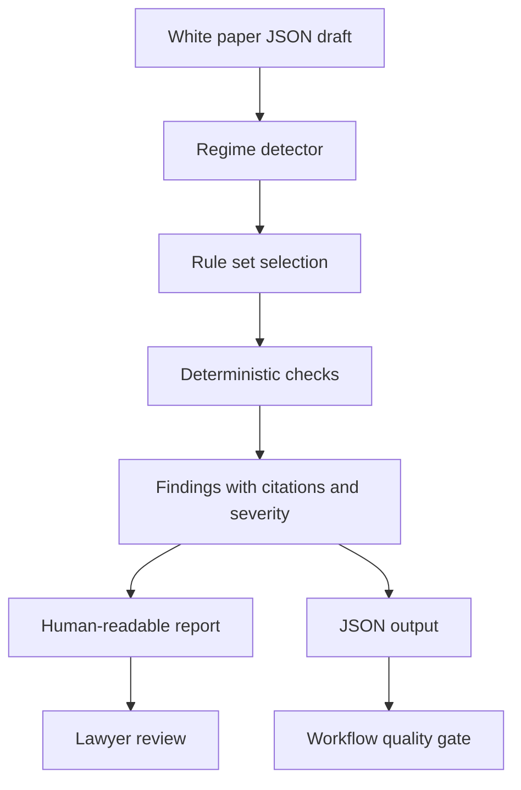

# Launch Readiness

This document helps a reviewer understand, run and evaluate the MiCAR Whitepaper Linter quickly.

## What this repo proves

The linter translates MiCAR white-paper review into deterministic, testable software rules. It does not replace legal judgment. It creates a first-pass quality gate that finds structural gaps, missing disclosures, thin sections and regime-specific review issues before a lawyer performs the substantive review.

The core proof is legal automation discipline: rule IDs, citations, severity levels, machine-readable output, strict mode and examples that are safe to inspect publicly.

## Architecture



## Local launch path

Run directly from source:

```bash
python3 -m micar_linter examples/art-stablecoin.json
python3 -m micar_linter examples/incomplete.json --strict
python3 -m micar_linter examples/emt-token.json --json
```

Install as an editable CLI:

```bash
pip install -e .
micar-lint examples/art-stablecoin.json
```

Optional PDF and DOCX ingestion:

```bash
pip install -e ".[all]"
```

## Demo path

1. Run the passing ART example.
2. Run the incomplete example in strict mode.
3. Show that blocker findings create a non-zero exit code.
4. Run JSON output and inspect machine-readable findings.
5. Open the sample reports under `reports/`.
6. Inspect `src/micar_linter/rules/` to show that legal review logic is explicit and testable.

## Checks

```bash
pytest
ruff check .
python -m micar_linter examples/incomplete.json --strict
python -m micar_linter examples/emt-token.json --json
```

## Sample data rule

Use synthetic white paper drafts only. Do not upload confidential issuer drafts, client white papers, unpublished token documentation or privileged legal comments.

## Safety posture

This is a screening tool supervised by a practising lawyer. It should help reviewers catch recurring structural gaps. It should not certify MiCAR compliance, replace source review or produce final legal advice.

## Good evaluator route

A reviewer should read the README, this file, `src/micar_linter/rules/`, `src/micar_linter/linter.py`, `src/micar_linter/report.py`, `examples/`, `reports/` and the tests. The key signal is that dense regulation has been turned into transparent, testable rules with lawyer review preserved.